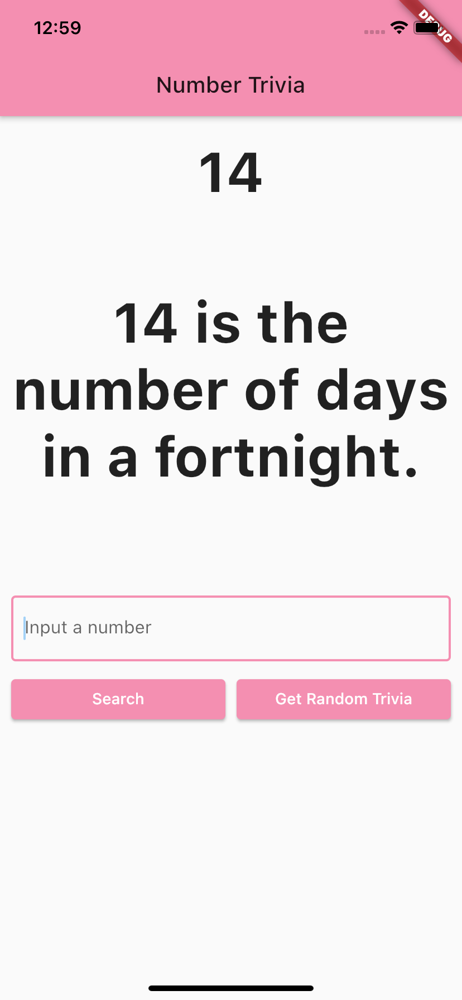

# Clean Arch Tdd Trivia App

A flutter project following the CLEAN architetcture and TDD (test driven development),as explained in this [playlist tutorial](https://youtube.com/playlist?list=PLB6lc7nQ1n4iYGE_khpXRdJkJEp9WOech) by Reso Coder. It is a number trivia app for concrete and/or random numbers using <http://numbersapi.com/>.

## Screenshot

## Note

this project is not 100% the same, I had to do some changes and in order for it to work with flutter 2.0, as well as some personal touches.
Also I would like to thank [Reso Coder](https://www.youtube.com/c/ResoCoder) for the amazing explanantion of the CLEAN architetcture and TDD.
